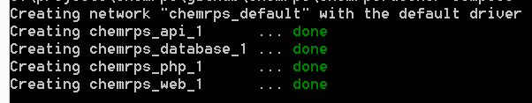
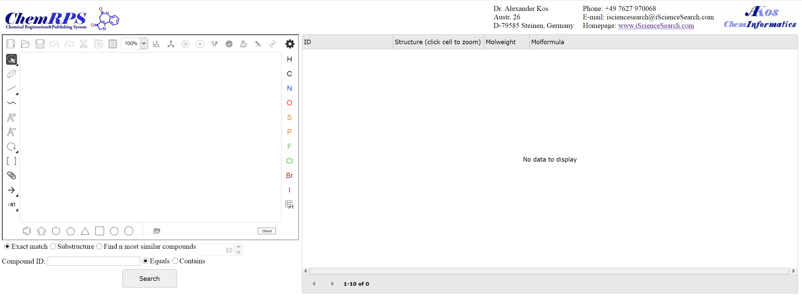
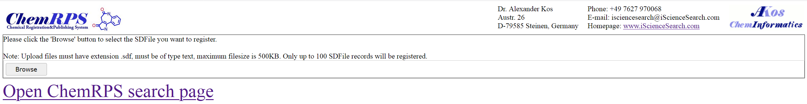

ChemRPS (Chemical Registration & Publishing System)
===================================================

Overview
--------

.. image:: docs/images/chemrps_logo_blue.jpg 

**ChemRPS** is a free Docker based system that allows you 
to load and search SDFiles by structure on your corporate website or local computer.

The system comes with a preconfigured RDKit enabled PostGresql database, a search engine (API) and 
a preconfigured webserver with register/search web pages including structure editor (Ketcher from EPAM).
It also contains a program that allows you to bulk load SDFiles.

ChemRPS is intended to be used by small or medium sized companies looking for an easy way to make
their chemical structures searchable on the Internet, without the need to invest a lot of money
for license fees or programming services.

Because of the easy deployment ChemRPS can also be used by individuals looking for an 'out-of-the-box'
solution that allows them to make structures contained in SDFiles searchable via Substructure and/or
Structure similarity search.

Installation

Download and install Docker
Link to installer page:<https://docs.docker.com/install/>

How to verify that Docker works?

Run simple test program

-Open command prompt (Windows) or terminal (Linux)
-Execute the following command:
 docker run hello-world (Windows)
 or
 sudo docker run hello-world (Linux)

This command downloads a test image and runs it in a container. 
When the container runs, it prints an informational message similar
to the below:

> docker run hello-world

docker : Unable to find image 'hello-world:latest' locally
latest: Pulling from library/hello-world
1b930d010525: Pull complete
Digest: sha256:c3b4ada4687bbaa170745b3e4dd8ac3f194ca95b2d0518b417fb47e5879d9b5f
Status: Downloaded newer image for hello-world:latest

Hello from Docker!
This message shows that your installation appears to be working correctly.
...
After verifying that you docker install worked:

Install ChemRPS

Linux:
------

Install git (it is probably already on your system; it is on Ubuntu 18.04 Desktop)
Ubuntu:
 sudo apt-get install git git-core
CentOS:
sudo yum install git

When git installed correctly
Clone the CHEMRPS repository

git clone https://github.com/chemrps-dev/chemrps.git chemrps

Then, change into the newly created directory

cd chemrps/

and run the following command (it is important that you do this from inside the chemrps directory – the “-s” after “sudo” ensures that the current directory is used by “sudo”)

sudo -s ./build

As a first step, this will create all necessary CHEMRPS Docker images to your system and may take a while for the initial setup

After the initial build, you can start the CHEMRPS system using

sudo -s ./run

To verify that the system got started correctly type the command:

docker container list

You should get an output similar to the below:

$ docker container list
CONTAINER ID        IMAGE               COMMAND                  CREATED             STATUS              PORTS                    NAMES
67aba6efe64c        chemrps_web         "nginx -g 'daemon ofâ¦"   12 seconds ago      Up 10 seconds       0.0.0.0:8080->80/tcp     chemrps_web_1
bdcd67be15f3        chemrps_database    "/opt/cpm/bin/uid_poâ¦"   14 seconds ago      Up 12 seconds       0.0.0.0:5432->5432/tcp   chemrps_database_1
5e4f6cd84559        chemrps_php         "docker-php-entrypoiâ¦"   14 seconds ago      Up 12 seconds       9000/tcp                 chemrps_php_1
762cd462d323        chemrps_api         "dotnet chemrpsapi.dâ¦"   14 seconds ago      Up 12 seconds       0.0.0.0:5003->5003/tcp   chemrps_api_1

Windows:
--------

Download CHEMRPS installer files
Open the following github link
https://github.com/chemrps-dev/chemrps
Download repository to your local computer

After the download complete unpack the archive to a local folder on your host computer

Open a command prompt and navigate to the folder you used unpacking the repository
Execute the following command:

@build

This command creates all necessary resources to run the CHEMRPS system.

Note: 

After building the CHEMRPS images, you are ready to start the system.

Execute the following command in your command prompt:
@run

You should get an output similar to the below:

If everything went fine, you should now be able to go to 
open the CHEMRPS preinstalled CHEMRPS search web page using the following link

http://yourhostname:8080/index.html

For example using ‘localhost’

http://localhost:8080/index.html

You should see a page such as the below:

After starting the CHEMRPS system the first time, there are no data present in the CHEMRPS database.
To populate the CHEMRPS database with data you can use the preinstalled CHEMRPS registration web page using the following link:

http://yourhostname:8080/registersdfile.html

The preinstalled registration page looks as the below:

To register a SDFile, click the ‘Browse’ button and navigate to your local SDFile.
Now click the ‘Upload All’ button
You should see a dialog that allows to choose what external fieldname in the uploaded SDFile should be used as ‘COMPOUND_ID’ in the CHEMRPS database

Note: COMPOUND_ID must be present in all SDFile records. The value for a given COMPOUND_ID inside the uploaded SDFile must be unique. In addition the value must not be present in the CHEMRPS database.
After picking your compound ID field, click the OK button in the field pick dialog
Now registration  starts and after a while (depending how many records are contained in your SDFile), you should see a result dialog that looks like similar to the below:

.. image:: docs/images/chemrps_picture_4.png

Close the result dialog and click the ‘Open ChemRPS search page’ link to open the search page
You can now do search for the data you registered.

.. image:: docs/images/chemrps_picture_5.png

Bugs, Comments and anything else
--------------------------------

For any bug or problem reports, contact me at my email contact@hjhimmler.de

Hans-Juergen Himmler, 2020-01-27
